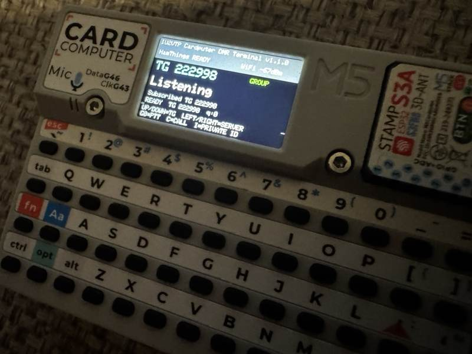

# IU2VTP Cardputer DMR Terminal

A compact **DMR-over-IP RX/TX terminal** for the **M5Stack Cardputer / StampS3**.

<p align="center">
  
</p>

It connects to compatible Open DMR Terminal Protocol / Rewind servers, authenticates, subscribes to a selected talkgroup, receives and decodes DMR audio, and can transmit live microphone audio with hold-to-talk PTT.

## Features

- Open DMR Terminal Protocol / Rewind
- BrandMeister and HamThings profile templates
- Group voice RX/TX
- Private-call TX by DMR ID
- Physical **G0 / BtnA** hold-to-talk PTT
- Keyboard **P** fallback PTT
- **C** toggles GROUP / PRIVATE TX mode
- **I** edits the private destination DMR ID
- Favorite talkgroups and direct TG entry
- Persistent current TG
- Multiple DMR server profiles
- On-device Wi-Fi setup
- Adjustable speaker volume
- Live caller / destination metadata
- RadioID.net caller lookup
- Half-duplex speaker/microphone handling
- Classic mbelib RX decode
- Embedded Rust `blip25-vocoder` AMBE+2 TX backend

## Hardware

- M5Stack Cardputer
- StampS3 / ESP32-S3

Built with PlatformIO + Arduino.

## Build

```bash
pio run -e m5stack-stamps3
```

Upload:

```bash
pio run -e m5stack-stamps3 -t upload
```

The build helper can bootstrap/link the Rust AMBE encoder backend for ESP32-S3.

## First-time setup

```text
Wi-Fi
  ↓
DMR Server
  ↓
Talkgroup
  ↓
RX / PTT
```

Default server templates:

### BrandMeister

```text
2222.master.brandmeister.network
UDP 54006
```

### HamThings

```text
2221.master.hamthings.it
UDP 54006
```

These are editable templates, not mandatory services.

## Main controls

```text
UP / DOWN       Previous / next favorite TG
LEFT / RIGHT    Previous / next ready DMR server
ENTER           Direct TG entry
G0 / BtnA       Hold-to-talk PTT
P               Keyboard fallback PTT
C               Toggle GROUP / PRIVATE TX
I               Enter private destination DMR ID
M               Settings
```

Private-call mode is independent of the current group talkgroup: changing TX mode does not alter the active RX/group TG.

## RX audio pipeline

```text
ODTP 0x0920 payload
→ 3 × 9-byte DMR AMBE+2 frames
→ rW/rX/rY/rZ deinterleave
→ classic mbelib
→ 160 PCM samples/frame
→ 8 kHz mono
→ Cardputer speaker
```

The RX path is known-good and should remain isolated from unrelated TX/UI work.

## TX audio pipeline

```text
G0 / PTT
→ Cardputer microphone 16 kHz
→ 2:1 downsample to 8 kHz / 160 samples
→ blip25 AMBE+2 encoder
→ DMR 72-bit rW/rX/rY/rZ interleave
→ 3 × 9-byte frames
→ 27-byte ODTP audio payload
→ Rewind UDP
```

TX is half-duplex. Speaker playback is stopped while the microphone owns the shared audio peripheral.

## Verified ODTP TX sequence

The working call flow was validated against live Open DMR Terminal servers:

```text
0x0911  DMR Voice LC Header
0x0911  DMR Voice LC Header
0x0920  DMR Audio (27 bytes)
0x0920  DMR Audio (27 bytes)
...
0x0912  DMR Terminator
```

The 12-byte Voice LC contains the group/private FLCO, destination ID, source DMR ID and RS(12,9) parity with the DMR Voice-LC mask.

A Rewind `0x0928 SUPERHEADER` is useful for RX metadata but is **not** used to start the working TX call path.

## Rewind transport

Packet header:

```text
"REWIND01"        8 bytes
type              uint16 little-endian
flags             uint16 little-endian
sequence          uint32 little-endian
payload length    uint16 little-endian
```

Important types:

```text
0x0000 KEEPALIVE
0x0002 CHALLENGE
0x0003 AUTHENTICATION
0x0900 CONFIGURATION
0x0901 SUBSCRIPTION
0x0902 CANCELLING
0x0911 DMR HEADER FLC
0x0912 DMR TERMINATOR
0x0920 DMR AUDIO
0x0928 SUPERHEADER
0x0929 FAILURE
```

Authentication:

```text
SHA-256(raw challenge + hotspot password)
```

## PTT safety / runtime behavior

- hold-to-talk only; no toggle PTT
- PTT allowed only when the DMR session is ready
- group TX targets the current TG
- private TX requires a valid destination DMR ID
- server/TG switching is blocked during TX
- BUSY / FAILURE / network loss aborts TX
- forced abort latches PTT until physical release
- maximum continuous TX timeout: 3 minutes
- RX queue is suppressed/reset around TX to keep operation half-duplex

## AMBE+2 encoder

TX uses the MIT-licensed `OpenBLIP25/blip25-vocoder` half-rate 3600×2450 codec through a Rust static library and C ABI.

See [docs/AMBE_ENCODER.md](docs/AMBE_ENCODER.md) for implementation and patent-notice details.

## Project structure

```text
.
├── platformio.ini
├── README.md
├── AGENTS.md
├── STEERING.md
├── codec/blip25_ffi/
├── docs/
├── include/
├── scripts/
├── src/
└── tools/
```

## Development guidance

Read:

- [AGENTS.md](AGENTS.md)
- [STEERING.md](STEERING.md)
- [.github/copilot-instructions.md](.github/copilot-instructions.md)

The central rule is now: **preserve the verified RX and TX protocol/audio paths unless a change specifically targets them**.

## Current release

```text
v1.1.1
```

v1.1.1 is a maintenance release that drains all pending TX audio on PTT release, prevents stale buffered speech from leaking into the next transmission, pads only the final incomplete 27-byte DMR packet with silence, and blocks PTT while RX traffic is active. It includes all v1.1.0 live ODTP RX/TX features.

## Status

Active amateur-radio software project. Test carefully after changes to:

- DMR authentication/subscription
- RX audio continuity
- PTT press/release
- Voice-LC call setup
- group/private destination handling
- network pacing
- Wi-Fi loss / BUSY / FAILURE aborts
- speaker restoration after TX

## Author

**IU2VTP**

Amateur radio software project for M5Stack Cardputer.
